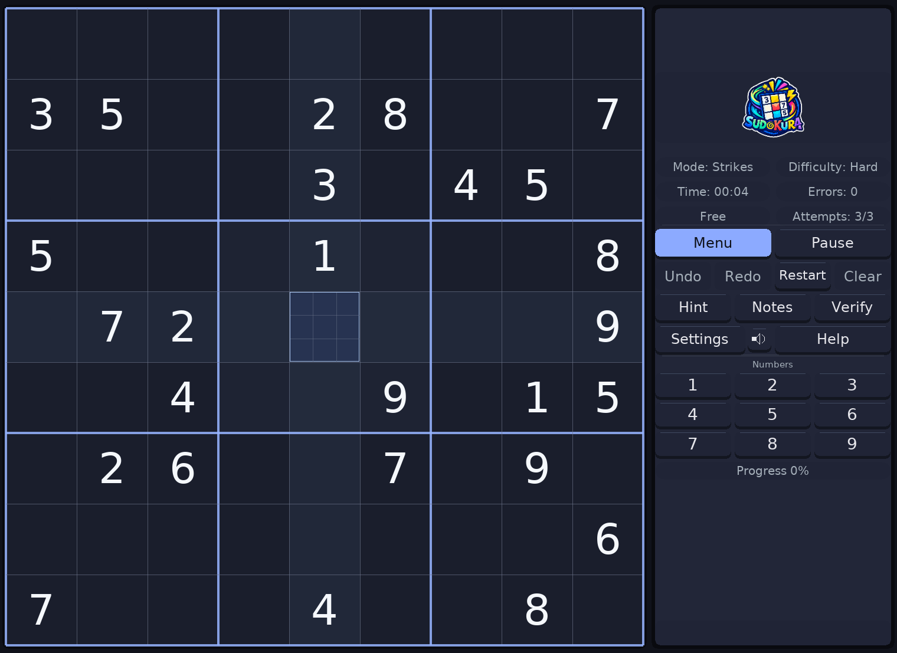

# Sudokura

<p align="center">
  
</p>

<p align="center">
  <strong>A fast, polished desktop Sudoku for Windows, Linux, and macOS.</strong>
</p>

<p align="center">
  <a href="https://github.com/santirodriguez/Sudokura/releases">Downloads</a>
  ·
  <a href="docs/RELEASE_NOTES_1.3.0.md">What's new in v1.3.0</a>
  ·
  <a href="docs/images/README.md">Screenshots</a>
  ·
  <a href="#build-from-source">Build from source</a>
</p>

Sudokura combines classic Sudoku with practical desktop features: Daily puzzles, multiple game modes, notes, hints, Undo/Redo, local results, themes, keyboard controls, and English / Español / Català.

**Sudokura runs entirely on your device. Games, settings, and progress are stored locally, and the app sends no telemetry.**

<p align="center">
  <a href="docs/images/sudokura-v1.3.0.png">
    
  </a>
</p>

## Highlights

- **Classic, Strikes, Time Attack, and Daily Sudoku.**
- **Easy, Medium, and Hard** puzzles with a unique solution and difficulty based on human-solving techniques.
- **Notes, Clear, Hint, Verify, Reveal, Undo/Redo, Restart, and Retry.**
- **Independent normal and Daily saves**, with automatic recovery safeguards.
- **Dark and light themes**, reduced motion, responsive layouts, and full mouse/keyboard navigation.
- **English, Español, and Català.**
- **Optional music and effects** with master, Music, and FX controls.
- Local result history and comparable personal-best tracking.

## Download

Get the latest builds from [GitHub Releases](https://github.com/santirodriguez/Sudokura/releases).

| Platform | Package | Status |
|---|---|---|
| **Windows 11 x64** | Installer or portable ZIP | Supported |
| **Linux x86_64** | AppImage | Supported |
| **macOS 15+ Apple Silicon** | DMG | Experimental |

Windows builds are not commercially code-signed, so SmartScreen may show a reputation warning. The macOS build is ad-hoc signed and not notarized.

### Linux

```sh
chmod +x Sudokura-v1.3.0-linux-x86_64.AppImage
./Sudokura-v1.3.0-linux-x86_64.AppImage
```

If FUSE is unavailable:

```sh
./Sudokura-v1.3.0-linux-x86_64.AppImage --appimage-extract-and-run
```

## Quick controls

| Action | Control |
|---|---|
| Move | Mouse, arrows, or WASD |
| Enter number | 1–9 |
| Clear | 0, Backspace, or Delete |
| Notes | N · Shift+1–9 · right-click |
| Undo / Redo | Ctrl+Z / Ctrl+Shift+Z or Ctrl+Y |
| Hint | H |
| Verify | Ctrl+Enter |
| Pause | P |
| Theme / Language | T / L |
| Master audio | V |
| Music / FX controls | Shift+V or long-press the speaker |
| Help / About | F1 / F2 |

Most actions are also available directly from the interface.

## Saves and upgrades

Sudokura keeps its data in the operating system's normal per-user application-data directory. v1.3 preserves compatible v1.2 data during migration and keeps recovery copies so an upgrade does not silently overwrite the previous valid state.

For save locations, migration details, rollback guidance, and useful bug-report information, see [Reporting Sudokura issues](docs/REPORTING_ISSUES.md).

## More screenshots

A small curated gallery covers Home / Continue, Settings, audio controls, compact Notes, and Help:

[Browse the v1.3.0 screenshot gallery →](docs/images/README.md)

## Build from source

Requirements: a C compiler, `pkg-config`, SDL2, SDL2_ttf, SDL2_mixer, Python 3, and Go.

```sh
make assets
make
make test
make test-ui
./sudokura
```

## Documentation

- [v1.3.0 release notes](docs/RELEASE_NOTES_1.3.0.md)
- [Changelog](CHANGELOG.md)
- [Implementation record](docs/V1.3.0_IMPLEMENTATION.md)
- [Issue reporting, saves, and rollback](docs/REPORTING_ISSUES.md)
- [Screenshot gallery](docs/images/README.md)

## Credits

Music: **Cozy Puzzle Jingle & Result** by **MintoDog**, from [OpenGameArt](https://opengameart.org/content/cozy-puzzle-jingle-result), licensed under **CC0**.

Language flags are from [lipis/flag-icons](https://github.com/lipis/flag-icons), licensed under MIT.

## Support

If you enjoy Sudokura and want to support its development, [support Sudokura here](https://santiagorodriguez.com/donate/).

GPLv3 · © 2025–2026 [Santiago Rodriguez](https://santiagorodriguez.com/)
