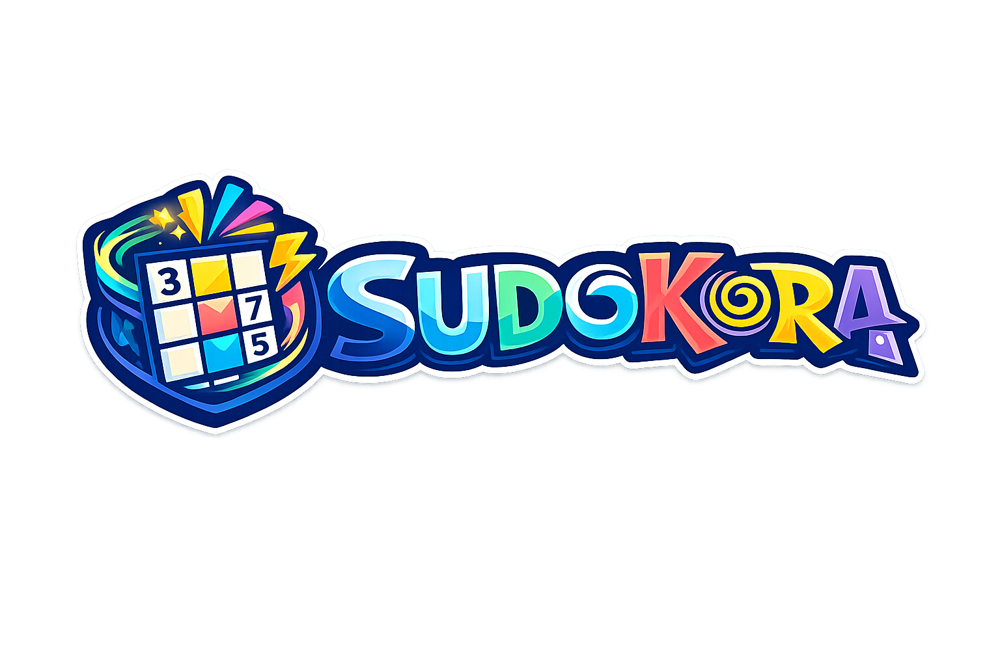

# Sudokura v1.1.0

<p align="center"></p>

A lightweight desktop Sudoku written in **C11 with SDL2 and SDL2_ttf**. Sudokura keeps its dark/light visual identity, notes, hints, verification, strict mode and three game modes while fitting every control into compact windows.

## Features and languages

- Classic, Strikes (three wrong moves), and 10-minute Time Attack modes.
- English, natural Argentine **Español**, and **Català**; press **L** to cycle the visible language selector.
- A responsive board, compact action grid and 3×3 numeric palette. The supported minimum is 640×480 and the same geometry drives drawing and pointer hit-testing.
- Dark/light themes, notes, conflict verification, hints, pause, and keyboard or mouse play.

## Controls

| Action | Control |
|---|---|
| Select | Mouse, arrows, or WASD |
| Place / clear | 1–9; 0, Backspace, or Delete |
| Notes | N, Shift+number, right-click, or a cell sub-position |
| Hint / strict mode | H / M |
| Theme / pause / language | T / P / L |
| Help / about / back | F1 / F2 / Escape |

## Build and test

Install a C compiler, `pkg-config`, SDL2, SDL2_ttf, Python 3, and Go (the latter two are used only by reproducible asset generation and validation).

```sh
make assets       # regenerate icons from immutable Sudokura05.png
make              # builds ./sudokura with C11 warnings enabled
make test         # deterministic gameplay, generator, i18n, and geometry tests
make test-ui      # SDL_ttf measurements for every language and viewport tier
make clean
./sudokura [--font /path/to/font.ttf]
```

The bounded desktop shell is tested from 640×480 through 3440×1440, and the
touch-ready stacked shell is tested at 360×640, 390×844, and 412×915. Runtime
packages bundle a UTF-8-capable fallback font. The English, Español, and Català
segments use the same geometry for rendering and pointer hit-testing.

`./sudokura --smoke-test` renders deterministic title and play frames without
interaction. `./sudokura --render-screenshots DIR` writes 40 dependency-free
BMP reviews covering ten viewports, four screens, all languages, and both themes.
`./scripts/validate_screenshots.py DIR` verifies every BMP's exact dimensions
and rejects missing or blank-looking frames. Fonts come from a 17-entry cache
(10–48 px); geometry selects separate note, body, control, cell, HUD, and heading
tiers without reopening fonts during frames.

## Packages

The tag/manual packaging workflow builds consistently named v1.1.0 artifacts and SHA-256 files, prints their sizes, and uploads artifacts. A tag run only creates a **draft** release for manual verification.

- **Linux:** executable x86_64 AppImage with the derived application icon and desktop entry.
- **Windows:** portable x86_64 ZIP with icon embedded in the executable, SDL runtime and recursively collected transitive non-system DLLs, plus DejaVu Sans and its license. CI fails on missing DLLs.
- **macOS:** separate x86_64 and arm64 unsigned ZIPs containing a real `Sudokura.app` (`MacOS`, `Frameworks`, `Resources`, `Info.plist`). SDL libraries, recursively collected non-system dependencies, DejaVu Sans, and its license are bundled; install names use `@rpath`, and CI rejects Homebrew or runner-local paths. Builds are **not signed or notarized**.

On macOS, unzip and drag `Sudokura.app` to Applications. Because current artifacts are unsigned, use Finder's **Open** context action if Gatekeeper asks you to confirm. No claim of signing or notarization is made.

## Asset policy

`assets/branding/source/` is immutable artwork. `scripts/generate_assets.py` removes only alpha values at or below 8, crops visible content, centers it with transparent padding, and losslessly writes PNG sizes 16–1024, a multi-size ICO, ICNS, and embedded 128×128 RGBA data for `SDL_SetWindowIcon`. Runtime packages contain only the required derivatives, never all five originals.

## Project scope

Android and iOS remain a later feasibility phase; v1.1.0 contains no mobile projects. See [v1.1.0 release notes](docs/RELEASE_NOTES_1.1.0.md) and the [technical implementation record](docs/V1.1.0_IMPLEMENTATION.md).

GPLv3 — © 2025–2026 [santirodriguez](https://santiagorodriguez.com)
