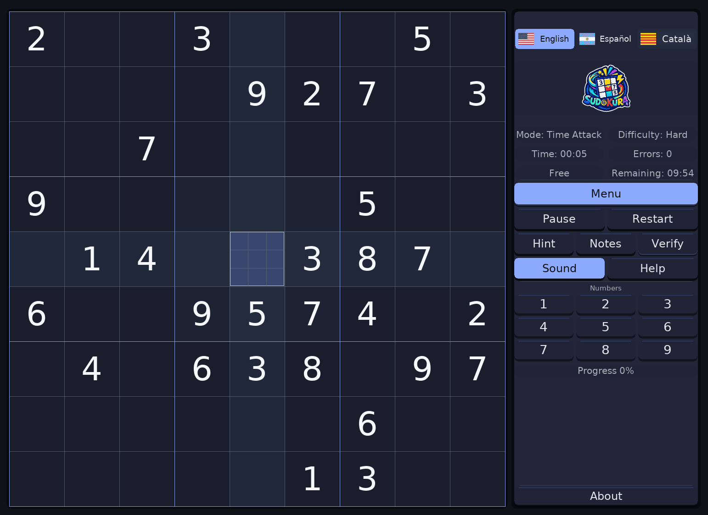
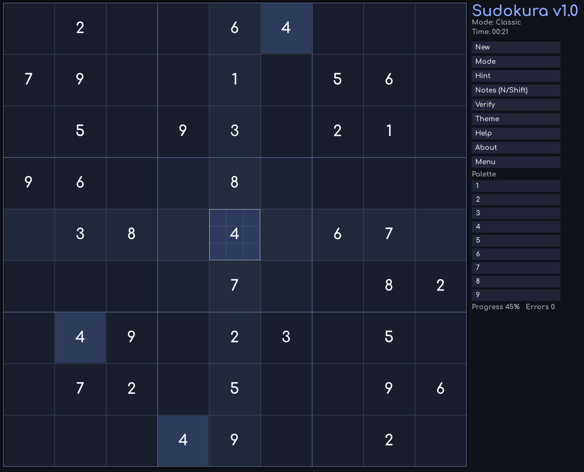

# Documentation images

Repository screenshots used by release notes and documentation belong in this directory.

## Proposed Sudokura v1.3.0 canonical screenshot

No v1.3.0 canonical screenshot is committed yet. The concrete proposal for user approval is:

- a **real packaged v1.3.0 build**, not a diagnostic/development render;
- 1366×768 desktop layout;
- dark theme;
- English;
- Classic · Medium in progress;
- representative player entries/notes with the global speaker visible;
- only the Sudokura window, with no notifications, usernames, paths, debug text, or other personal information.

After explicit approval, the canonical filename should be `sudokura-v1.3.0.png`.

Do not substitute any `--render-screenshots` diagnostic frame for this image.

## Sudokura v1.2.0

- File: `sudokura-v1.2.0.png`
- Dimensions: 1542×1124
- Status: canonical v1.2.0 screenshot, supplied after the final Linux release candidate was manually tested and approved.

## Historical interface — v1.1.0

- File: `sudokura-v1.1.0.png`
- Dimensions: 1112×944
- Status: historical v1.1.0 interface; it is not the canonical v1.2 screenshot.

## Historical interface — v1

- File: `sudokura-v1.png`
- Dimensions: 1713×1383
- Status: retained as the visual record of the original v1 interface.

The legacy file is byte-identical to the former root-level `screenshot.png`. The duplicate root file was removed after this archival copy was confirmed.

## Naming policy

Use `sudokura-v<version>.png` for canonical release screenshots. Images should show only the application at a readable size, without unrelated windows or personal information. PNG is preferred so text and board lines remain sharp.
